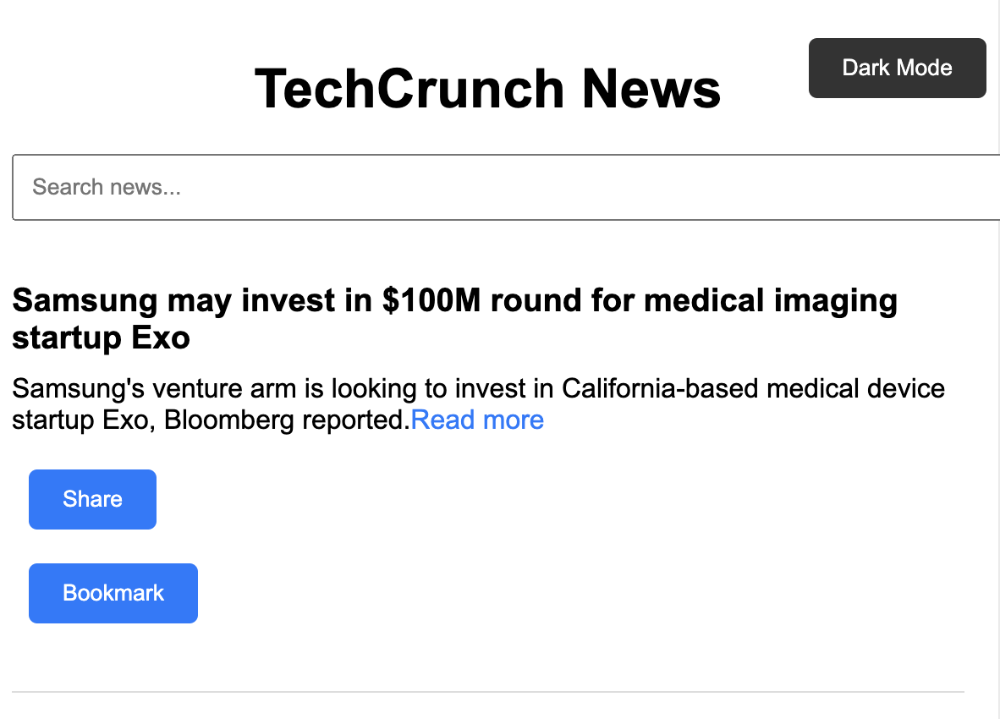
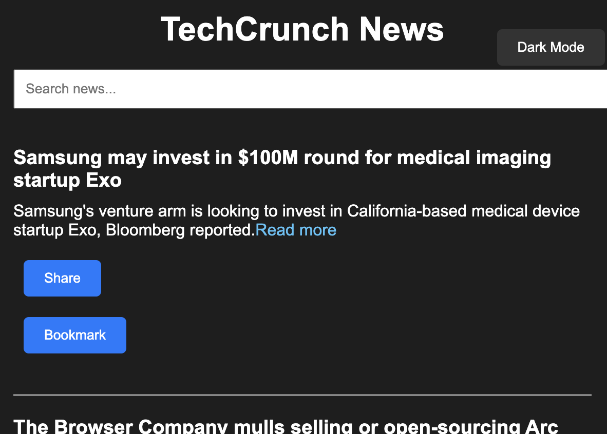

# 📰 TechCrunch News Aggregator

A lightweight and elegant News Aggregator web app that fetches and displays the latest articles from **TechCrunch** using RSS feeds. Built with pure HTML, CSS, and vanilla JavaScript — no frameworks, no bloat.

## 🚀 Features

- 📡 Fetches live news via RSS feed using `rss2json` API
- 🔍 Real-time search functionality for article titles
- 📥 Lazy loading with "Load More" pagination
- 🌙 Dark mode toggle
- 🔖 Bookmark articles to `localStorage`
- 📤 Native Share API integration (mobile/web supported)

   ---

## 🧰 Tech Stack

- **HTML5** – Semantic structure
- **CSS3** – Custom styling with dark mode support
- **JavaScript (Vanilla)** – DOM manipulation, API calls, interactivity
- **API Used**: [`rss2json`](https://rss2json.com)

  ---

## 📸 Screenshots





 ---
 

## 📦 Getting Started

To get started with the TechCrunch News Aggregator:

1. **Clone the Repository**
   ```bash
   git clone https://github.com/jainapal/News-Aggregator.git
   cd News-Aggregator
   
2. **Open in browser**
No build tools needed. Just open index.html in any modern browser.

---


### 💾 Bookmarks Storage
Bookmarked articles are saved in localStorage and persist across sessions (browser-only).

---

**Learning Outcomes**

DOM manipulation without libraries

Handling RSS feeds via APIs

State management with localStorage

Event-driven UI updates

Progressive Enhancement (Dark Mode + Share API)

---

📬 Contact
Jaina Pal
https://github.com/jainapal
